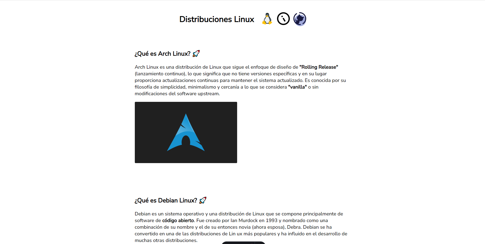

# Distribuciones Linux 💻

Un projecto de un sitio web sobre distribuciones linux, creado con Astro 🚀

## Screenshot



## Instalando

```bash
git clone https://github.com/EduardYan/distros-linux-website.git
cd distros-linux-website
```

### Dependencias:

```bash
npm i
```

## Ejecutando

Ahora ejecutar:

```bash
npm run dev
```

Y visita 👉 [http://localhost:4321](http://localhost:4321) y listo ✅

## Build

Para build ejecutar:

```bash
npm run build
```
